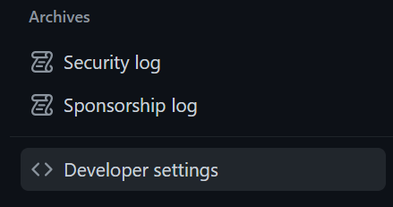

# GitHub Local Setup

## Credentials

> If you are reading this, then it is assumed that you have a GitHub account.  However, you will need to generate a personal access token which you will use as a password for pulling and pushing the repository remotely.  

 To do this login to GitHub then:

* On the top right corner of the screen click on your profile icon.  When the drop-down appears click on **Settings**.


* Once on your profile page, there is a list of options of the left side.  Click **Developer Settings** at the bottom.  

* Now click **Personal access tokens**, on the drop-down that appears click **Tokens (classic)**.  

* Click the button, **Generate new token**, in the drop-down select **Generate new token (classic)**.  

* Here input a name in the **Note** field and select an expiration timeframe.
* Under **Select scopes** click the parent box for **repo** (this  will auto-check child boxes) then scroll to the bottom and click the **Generate token** button.  
* The new screen that appears will display your personal access token, be sure to copy it.  

___
> Below is a brief rundown of what you need to get started. If you want more thorough or diverse instructions, check out [GIt Guides](https://github.com/git-guides) or [Git Docs](https://git-scm.com/docs).  

## **Git commands**

> _These commands would be performed in the command line (CLI), text editor or IDE where you can access the terminal to manipulate both your local and the main repository._
>
> Follow the below instructions from top to bottom.  

```git
git config --global user.name "GitHub-username"
```

```git
git config --global user.email "GitHub-email"
```

* Setup your account locally by inputing the email and username GitHub account within quotations.

___

```git
git clone https://github.com/your_repo
```

* This command will clone the repository for you to use locally.  
* This should only need to be done once.  

___
> After you have made your changes to the files within your local repository, check the status using the following command.

```git
git status
```

* This shows the status of the commit, displaying everything that you have changed.
  * Red = not ready to be sent.
  * Green = ready to be sent.


___

```git
git add -A
```

* This adds all the untracked files to the commit.  This should catch all the "red" files/changes.

  * _Note -  Be sure to save the files before adding them to the commit._

___

> At this point check the status (`git status`) again to ensure that all files are now showing green.  
>
>
>
> If they are, then continue on with the commit command below.  

```git
git commit -m "commit message"  
```

* Commits / stages for push to origin repo.  Within the quotations you can leave a message stating what you changed.  

___

```git
git push -u origin master       
```

* Pushes the commit to the origin repository.  

> Here you will be asked to input your GitHub username and password, the password will be your personal access token.  
___

```git
git pull
```

* This pulls the most recent repository from main to your local machine.  You should do this every time to refresh your local repository before you start working.  

___

## **Key Terms**

* IDE - Integrated development Environment such as [PyCharm](https://www.jetbrains.com/pycharm/).  
* Text editor - such as [Visual Studio Code](https://code.visualstudio.com/).  
* CLI - Command line interface or terminal such as [WSL](https://learn.microsoft.com/en-us/windows/wsl/install) and [Powershell](https://www.howtogeek.com/662611/9-ways-to-open-powershell-in-windows-10/).  
